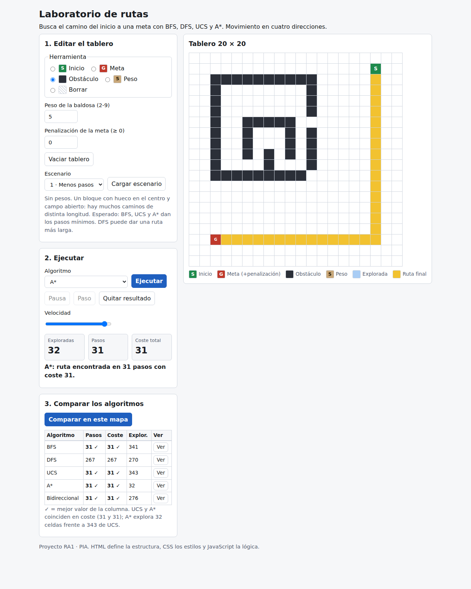
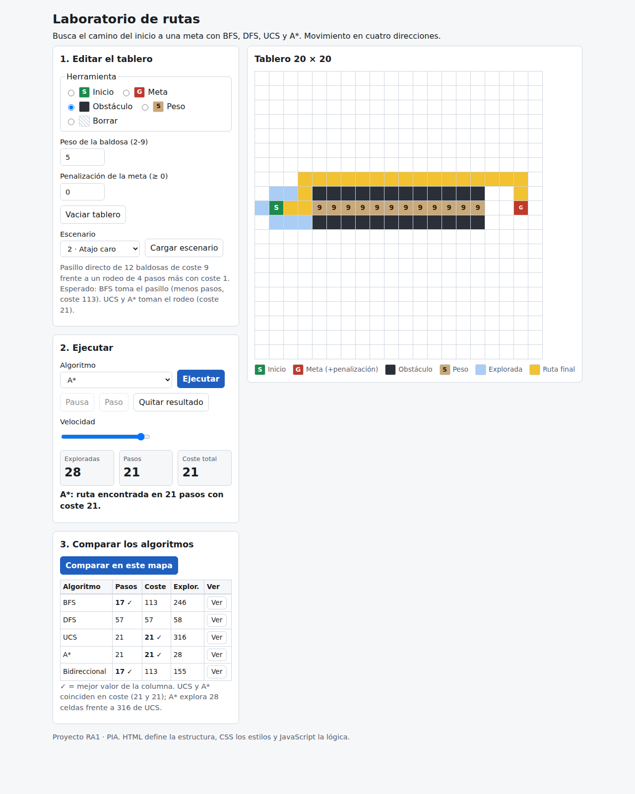
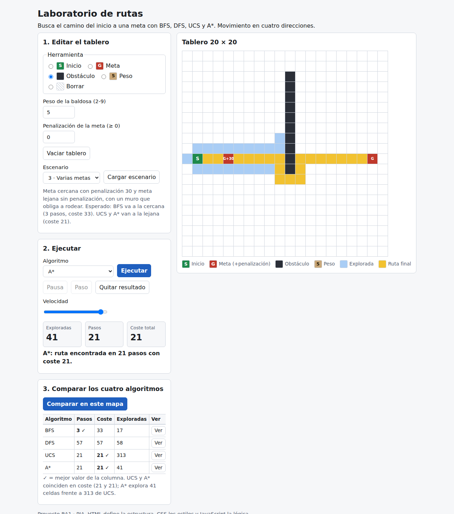
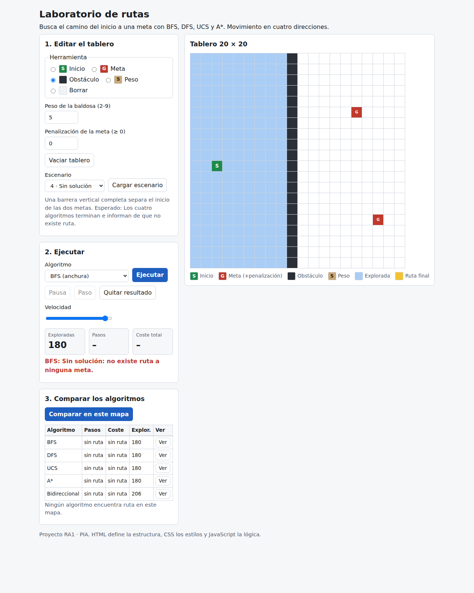
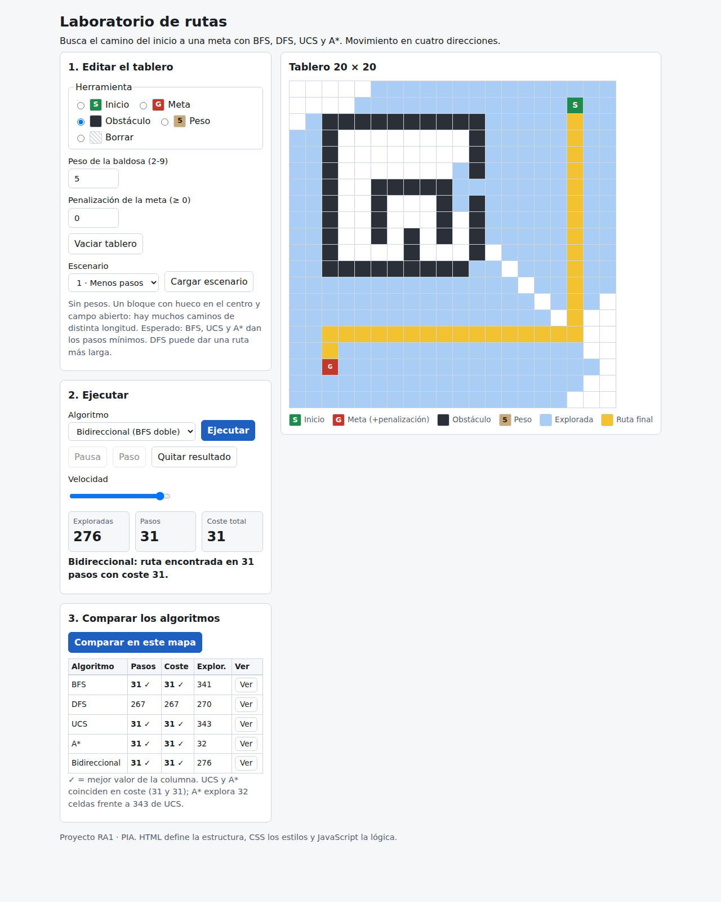

# Laboratorio de rutas: BFS, DFS, UCS, A* y bidireccional

- Repositorio: https://github.com/daaniel53254/laboratorio-rutas
- Netlify: https://laboratorio-rutas-daniel.netlify.app/
- Informe: [informe/Informe_Laboratorio_Rutas.pdf](informe/Informe_Laboratorio_Rutas.pdf)

## Objetivo
Comparar de forma visual cómo buscan una ruta BFS, DFS, UCS, A* y la búsqueda bidireccional sobre el mismo tablero editable.
Se miden pasos, coste y celdas exploradas para ver cuándo conviene cada algoritmo.

## Tecnologías
HTML, CSS, JavaScript con módulos ES (sin dependencias), Node solo para las pruebas, Git, GitHub y Netlify.

Aplicación web (HTML + CSS + JavaScript sin dependencias) con un tablero editable de 20 x 20 para comparar cinco algoritmos de búsqueda sobre el mismo mapa.

## Uso
- Local: `npx serve .` (o `python3 -m http.server`) y abrir la dirección que indique. Hace falta servidor porque se usan módulos ES.
- Pruebas: `node tests/run-tests.mjs`
- Netlify: publicar la carpeta raíz (sin build).

## Estructura
- `index.html`: estructura y controles (marcado).
- `css/style.css`: estilos, tema claro/oscuro.
- `js/board.js`: modelo del tablero y reglas de edición coherente.
- `js/algorithms.js`: BFS, DFS, UCS, A* y búsqueda bidireccional.
- `js/scenarios.js`: cuatro escenarios reproducibles.
- `js/app.js`: interfaz, animación, métricas y comparación.
- `tests/run-tests.mjs`: 18 pruebas.

## Reglas
Movimiento ortogonal. Entrar en una celda cuesta 1 o su peso (2-9). Cada meta tiene una penalización >= 0 que se suma al coste total. Heurística de A*: mínimo sobre las metas de (distancia Manhattan + penalización).

## Algoritmos
- **BFS**: cola FIFO. Encuentra la ruta con menos pasos e ignora pesos y penalizaciones.
- **DFS**: pila LIFO. Encuentra una ruta, pero no necesariamente corta ni barata.
- **UCS**: cola de prioridad por coste acumulado. Da la ruta de menor coste total, penalización de meta incluida.
- **A***: como UCS, pero ordena por coste acumulado más una heurística: el mínimo sobre las metas de (distancia Manhattan + penalización de esa meta). Es admisible porque cada paso cuesta al menos 1 y Manhattan nunca sobreestima, así que es óptimo y explora menos celdas que UCS.
- **Bidireccional**: dos BFS, uno desde el inicio y otro desde todas las metas, que se encuentran en medio. Ver la sección de la mejora extra.

## Búsqueda bidireccional (mejora extra)
Dos BFS por capas completas: uno desde el inicio y otro desde todas las metas a la vez, que se detienen cuando se tocan. Con varias metas resulta la más cercana por pasos.
- Límites: ignora pesos y penalizaciones de meta, igual que BFS, así que solo es óptima en número de pasos, no en coste.
- Puede explorar menos celdas que BFS, porque cada búsqueda cubre solo la mitad del recorrido; en el escenario 4 (sin solución) explora más, ya que agota los dos lados.

## Escenarios (pasos / coste / exploradas)
| Escenario | BFS | DFS | UCS | A* | Bidireccional |
|---|---|---|---|---|---|
| 1 Menos pasos | 31/31/341 | 267/267/270 | 31/31/343 | 31/31/32 | 31/31/276 |
| 2 Atajo caro | 17/113/246 | 57/57/58 | 21/21/316 | 21/21/28 | 17/113/155 |
| 3 Varias metas | 3/33/17 | 57/57/58 | 21/21/313 | 21/21/41 | 3/33/7 |
| 4 Sin solución | sin ruta/180 | sin ruta/180 | sin ruta/180 | sin ruta/180 | sin ruta/206 |

## Pruebas
Requieren Node.js. Desde la raíz del proyecto: `node tests/run-tests.mjs`. Muestra una línea OK por prueba, el total y la tabla de escenarios.
Las 18 pruebas cubren:
- Mapas: los escenarios son de 20 x 20 y una celda no puede ser muro y meta a la vez.
- Rutas: fila recta, obstáculos que se rodean, pesos, varias metas y penalización de meta.
- Errores: sin inicio, sin meta y mapa sin solución.
- Edición: el resultado cambia al editar el mapa después de ejecutar.
- Escenarios 1 y 2: pasos mínimos y rutas con pesos.
- UCS y A*: mismo coste óptimo en los escenarios y en 200 mapas aleatorios con pesos.
- Bidireccional: mismos pasos que BFS en el escenario 1 y en 300 mapas aleatorios, sin ruta en el escenario 4, menos celdas exploradas que BFS en un mapa abierto y elección de la meta más cercana por pasos.

## Capturas

## Limitaciones
- Sin movimiento en diagonal: solo arriba, abajo, izquierda y derecha.
- La bidireccional ignora pesos y penalizaciones, y solo es óptima en número de pasos, no en coste.
- Pensado para tableros de 20 x 20.
